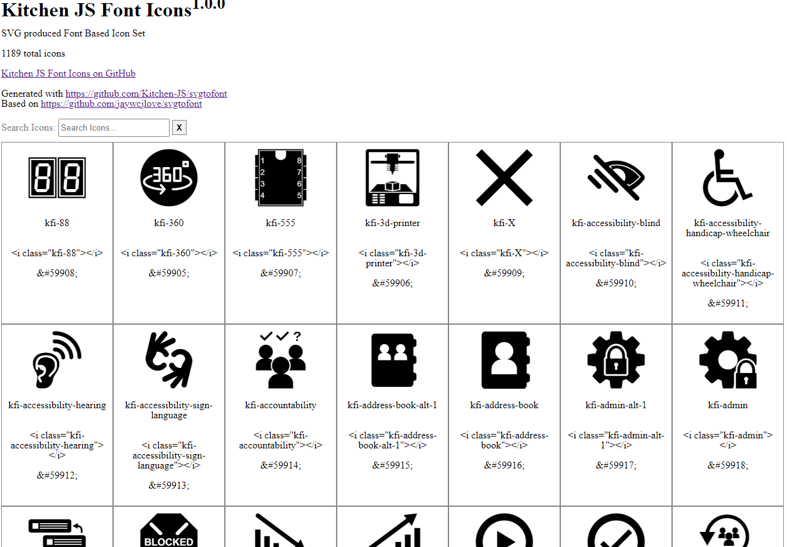

# KitchenJSFontIcons
Kitchen JS Font Based Icons

## ScreenShots


## Build Icons
```
npm run build
```
or
```
node create.js
```
```
node build.js
```

## Use
Go to the fonts folder in the repo or in the root of the release version. Example html in index.html. kfi.js is not required but is a useful key value pair to get the hex values by icon name for use on things like an html5 canvas.
```
   <link rel="stylesheet" href="kfi.css" />
   <link rel="stylesheet" href="kfi.js" />
   
   <i class="kfi-kitchenjs-logo"></i>
```

### kfi.js JS Methods
Get HTML char code ex ```"ebca"```, ```&#ebca;```, ```\ebca```

outputs ebca
```
kfi["kfi-kitchenjs-logo"]
```
or
```
kfi.getChar('kfi-kitchenjs-logo')
```
Examples
```
kfi.getChar('kfi-kitchenjs-logo').char // ""  
```
```
kfi.getChar('kfi-kitchenjs-logo').unicode // "ee80"
```
```
kfi.getChar('kfi-kitchenjs-logo').htmlcode // "#61056;" 
```
to use 
```
&amp; + kfi.getChar('kfi-kitchenjs-logo').htmlcode
```


## Credits
- Based on work done by PEC https://github.com/PEC-Development-Team/PEC-Font-Based-Icons
- PFI is composed of opensource svg icons but a ton of work done by https://github.com/andrewdeclue
- Uses Base Library https://github.com/Kitchen-JS/svgtofont a refactored version of https://github.com/jaywcjlove/svgtofont
- Based on work done by KitchenJS https://github.com/Kitchen-JS/svgtofont-test


### Log
```
npm install https://github.com/Kitchen-JS/svgtofont
```
